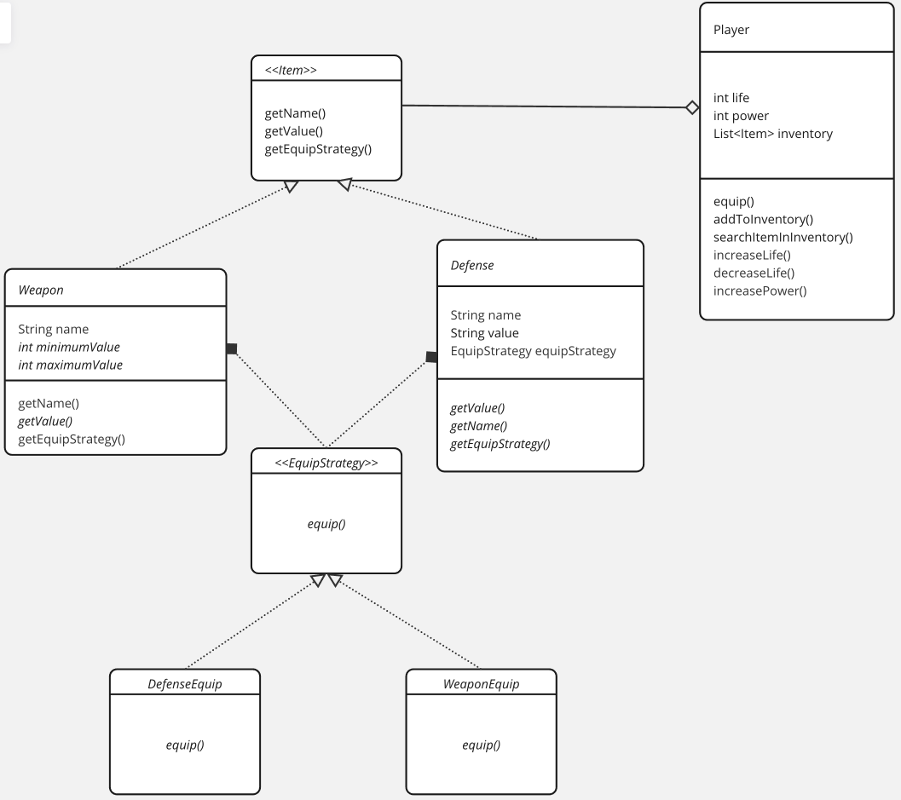

# Modelo de parcial 3: 

Se desea programar un juego de rol dentro del cual, cada personaje que contendrá va a tener los siguientes elementos:

* Vida: Número entero que se setea a la hora de instanciar al personaje.

* Fuerza: Cantidad de puntos que resta a la vida del enemigo al atacarlo.

* Inventario: Que estará compuesto por un conjunto de, como máximo, 8 items. Cada item tiene un nombre que lo identifica unívocamente. Para que un ítem tenga efecto, tiene que ser equipado. Y se equipará mediante el metodo de la clase personaje:

`void equipar(String nombreDelItem)`;

De igual manera existirá un método para desequipar un ítem. Si el ítem no se encuentra en el inventario, se debe lanzar una excepción.

#### Van a existir dos tipos de ítems:
* Armas: Se utilizan en los combates y definen cuanto más daño se debe sumar a la fuerza, a la hora de realizar un ataque. Cada arma tiene un daño mínimo y máximo. A la hora de combatir, se elige un daño al azar entre el mínimo y el máximo.

`ThreadLocalRandom.current().nextInt(0, 10)`;

* Item de defensa: Se utilizan para aumentar la vida del personaje.

Para simular un combate, tendrá que existir el siguiente método en la clase personaje:
`void atacar(Personaje oponente);`

Tener en cuenta que la vida de un personaje no puede ser menor que cero.

